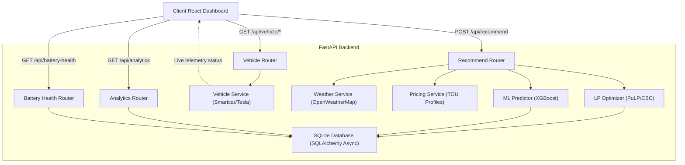

# 02. Architecture

## High-Level System Architecture

The EV Charging Recommendation system is built as a complete, stateful web application comprising an asynchronous FastAPI backend, an XGBoost machine learning wear-prediction pipeline, a persistent database layer, and a high-density React frontend dashboard.

---

## Component Breakdown

### 1. API Layer (`backend/api/routes/`)
- **`recommend.py`**: Accepts charging configurations, invokes weather and pricing updates, optimizes the schedule, runs XGBoost degradation inference, and returns recommendations.
- **`vehicle.py`**: Manages OAuth2 authorization with Smartcar and handles token exchanges, connection status checks, and disconnects.
- **`analytics.py` & `battery_health.py`**: Pulls historical logs from SQLite to drive dashboard charts and battery status gauges.

### 2. Service Layer (`backend/services/`)
- **`vehicle.py`**: Fetches battery telemetry (SoC, capacity, health) from Smartcar or Tesla APIs, with a simulated demo mode fallback.
- **`weather.py`**: Connects asynchronously to OpenWeatherMap to pull temperature and humidity adjustments.
- **`pricing.py`**: Provides 5 regional dynamic Time-of-Use pricing matrices (US_CA, US_TX, UK, DE, IN).
- **`optimizer.py`**: Solves the PuLP LP charge/discharge (V2G) problem.
- **`explainer.py`**: Translates numerical arrays into conversational recommendations.

### 3. Machine Learning Layer (`backend/ml/`)
- **`predict.py`**: Loads the pre-trained **XGBoost** model to predict battery degradation wear scores (0-100) based on temperature, C-rate, and target SoC.

### 4. Database Layer (`backend/models/`)
- **`database.py`**: Configures the asynchronous SQLite connection using `aiosqlite` and `SQLAlchemy`.
- Persists all executed charging sessions for history, SOH analysis, and trend reporting.

### 5. Frontend UI (`frontend/src/`)
- A professional dark dashboard built with **React**, **TypeScript**, and **Tailwind CSS**.
- **`api.ts`**: Axios client for calling endpoints.
- **`pages/`**: Includes Dashboard, Optimizer (with telemetry auto-fill and region select), Battery Health, and Analytics trend charts.
