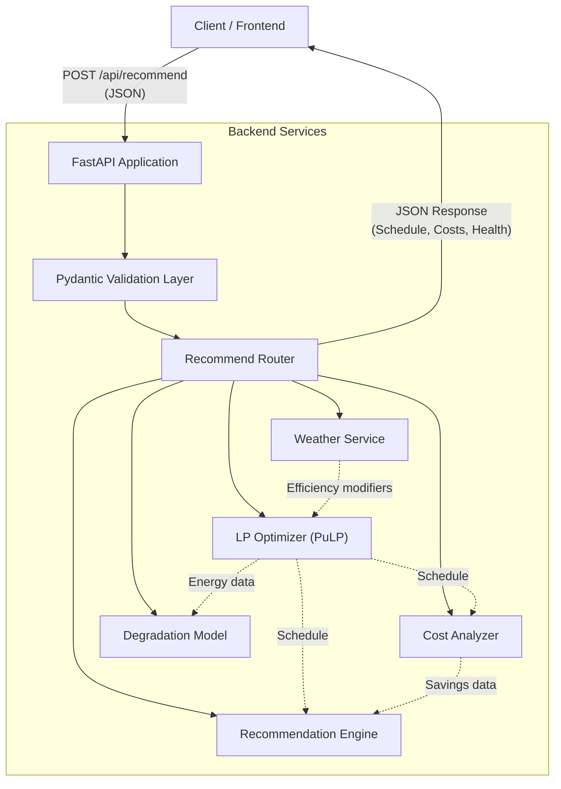

# 02. Architecture

## High-Level System Architecture

The current system (Phase 1) is built as a robust, stateless backend service using FastAPI. It is designed to be the foundational intelligence layer for a future full-stack application.

## Component Breakdown

### 1. API Layer (`backend/api/`)
*   **`main.py`**: The entry point. Configures the FastAPI app, sets up CORS, and registers routers.
*   **`routes/recommend.py`**: The primary orchestrator. It receives the request, calls all underlying services in the correct sequence, and formats the final response.

### 2. Validation Layer (`backend/models/schemas.py`)
*   Uses **Pydantic v2** to strictly define and validate all inputs and outputs.
*   Ensures that SoC is between 0-100, capacities are positive, and time formats are correct *before* any processing occurs.

### 3. Service Layer (`backend/services/`)
This is where the business logic resides. Services are designed to be modular and testable independently.
*   **`optimizer.py`**: Formulates the LP problem and calls the CBC solver.
*   **`battery_degradation.py`**: Calculates the wear score based on temperature, SoC, and charge rate.
*   **`cost_analyzer.py`**: Computes the cost difference between the optimized schedule and a baseline strategy.
*   **`weather.py`**: Provides heuristics for how weather affects charging efficiency.
*   **`recommendation_engine.py`**: Synthesizes the data into human-readable advice strings.

## Why FastAPI?
*   **High Performance:** Built on Starlette, it is one of the fastest Python frameworks available.
*   **Built-in Validation:** Pydantic integration drastically reduces boilerplate code for input checking.
*   **Auto-Documentation:** Automatic Swagger UI generation makes API testing and frontend integration seamless.
